

# Pablo Picasso
Jakob Hofer

---

# Hard Facts
- voller Name: Pablo Ruiz Picasso
- Geburtsdatum: 25.10.1881
- Todesdatum: 8.4.1973
- Maler, Grafiker und Bildhauer
- über 50 000 Werke

---

### Frühe Jahre
- geboren in Málaga (Spanien)
- Diego, José, Francisco de Paula, Juan Nepomuceno, María de los Remedios und Cipriano de la Santísima Trinidad
- Vater war freischaffender Maler und Lehrer
- mit 7 begonnen zu malen
- Umzug + mit 10 Schule für Bildende Künste

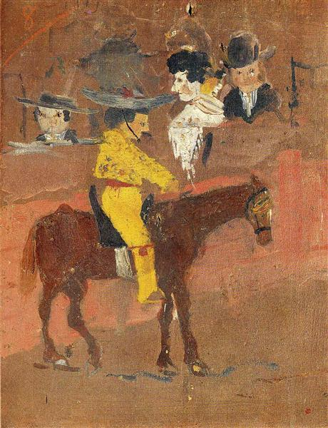

---

### Studium
- 1895 Umzug nach Tod der Schwester
- mit 14 Studium an Kunstakademie La Llotja
  - zwei Klassen übersprungen
- Studium an königlichen Akademie von San Fernando
  - nach kurzer Zeit verlassen

### Midlife
- häufige Standortwechsel
- 1901 Gründung Literaturmagazin "Young Art"

---

### Die blaue Periode
- 1901 - 1904
- hauptsächlich blaue Farben
- erste Ausstellung in Paris
- Partnerschaft mit Fernande Olivier

### Die rosa Periode
- Ab 1905 von blau -> rosa
- erstes Werk: "Junge mit Pfeife"

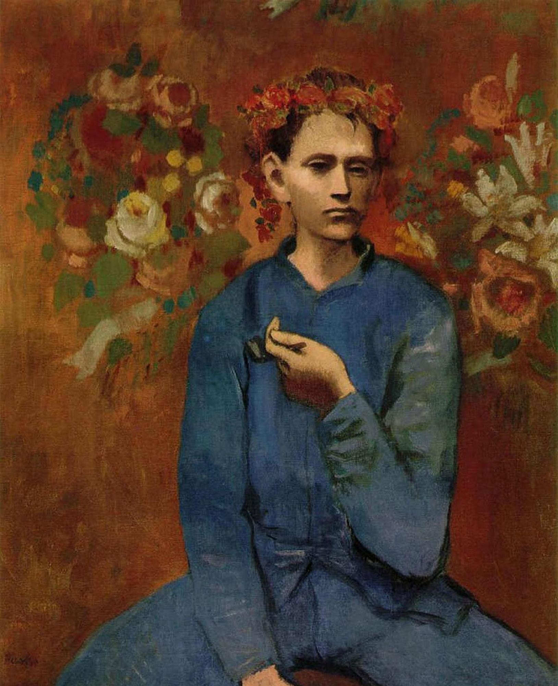

---

### Begründung des Kubismus
- Austausch mit Braque
- "cubes" -> Kubismus
- Picasso, Braque, Kahnweiler
- 1908 - 1909 intensive Zusammenarbeit

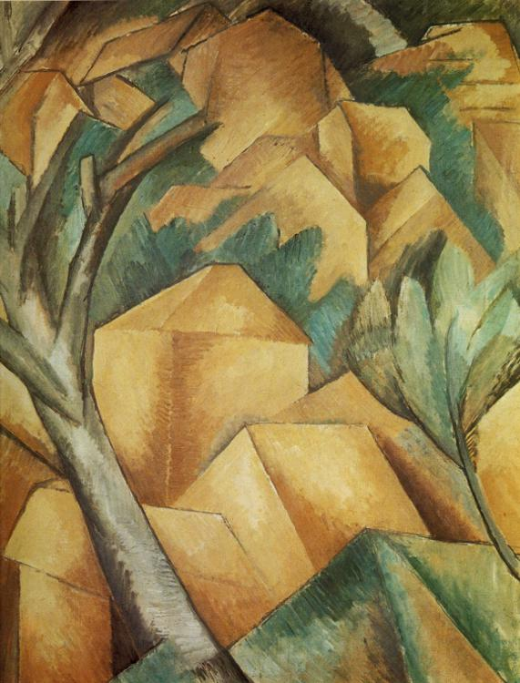

---

### Diebstahl der Mona Lisa
- Sommer 1911
- Picasso und Freund Apollinaire verdächtigt
- Apollionaire verhaftet
- Picasso verhört
- 1912 Prozess eingestellt
- 13.12.1913: Mona Lisa ist zurück!
  - Täter: Vincenzo Peruggia

---

### Erste Ausstellungen im Ausland
- zunehmende Bekanntheit Picassos
- Deutschland, London, New York
- Fernande Olivier -> Eva Gouel
- 1913 Tod des Vaters

---

### Erster Weltkrieg
- Künstlerkollegen haben Stellung
- Picasso bleibt in Paris zurück
- ab 1914: Entfernung vom Kubismus
  - negative Entwicklung
  - stattdessen verschiedene Experimente

---

### Erster Weltkrieg
- 1915 Tod Gouels
  - Verhältnis mit Gabrielle Lespinasse
  - 1916 Abweisung
- Tänzerin Olga Stepanowna Chochlowa
  - Hochzeit am 12. Juli 1918
  - nach wenigen Jahren bereits Entfremdung

---

### Surrealismus
- 1923 Treffen mit Surrealist André Breton
- früh Abbildungen in Zeitschrift 'La Révolution surréaliste'
- Konflikte mit Surrealisten
- 1927 Beziehung mit Marie-Thérése Walter
  - 1935 Geburt der Tochter Maya
    - Ehefrau verlangt Scheidung
      - Picasso verweigert

---

### Der spanische Bürgerkrieg
- 1936 Bilder zum spanischen Bürgerkrieg
- 1937 Ende der Beziehung mit Marie
- Picasso unterstützt republikanische Regierung
- versucht, französische Regierung zum Eingreifen zu motivieren

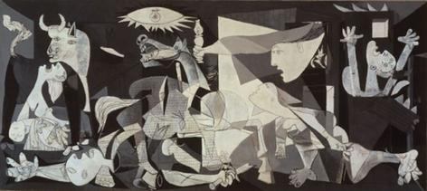

---

### Der spanische Bürgerkrieg
- vergeblicher Einsatz
- 1937 dafür Direktor des Kunstmuseums Prado in Madrid
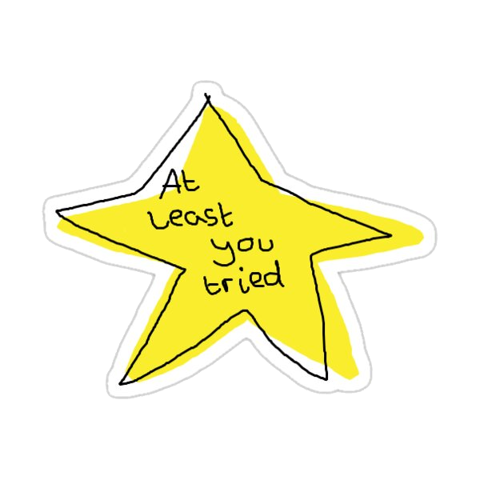

---

### Der zweite Weltkrieg
- Atelier in Paris
- moderne Kunst nicht toleriert
- 1944 Mitglied kommunistischer Partei Frankreichs

---

### Die späten Jahre
- Einfluss von Maler Henri Matisse
- Beziehung mit Malerin Francoise Gilot
  - ein Sohn, eine Tochter
  - 1953 von ihr verlassen

---

### Die späten Jahre
- unabhängige Einstellung
- Einsatz für den Weltfrieden
- 1949 Entwurf der Friedenstaube
- 1962 Internationaler Lenin-Friedenspreis

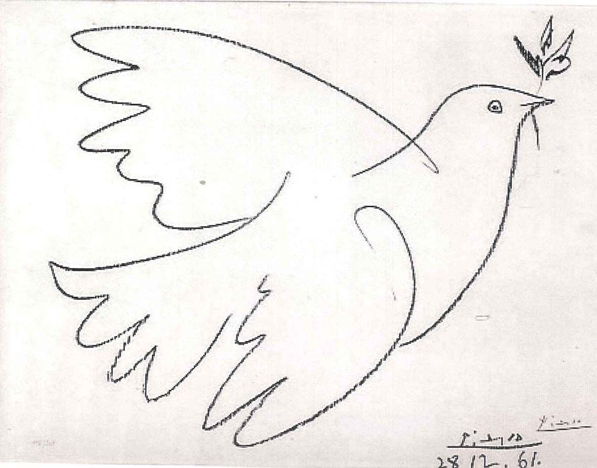

---

### Letzte Umzüge
- 1958 Umzug ins Schloss Vauvenargues
  - Studio und Lager für Bilder
- 1961 letzte Hochzeit
  - Jacqueline Roque
- Umzug nach Mas Notre-Dame (30km von Nizza)
- 1971 Retrospektive im Louvre
  - anlässlich Picassos 90. Geburtstages
  - erster lebender Künstler

---

### Der Tod
- 8.4.1973
- große Zahl an Werke
  - 1 900 Gemälde, 12 000 Zeichnungen, 1 300 Skulpturen
- Ausstellungen in diversen Museen

---

### Was bleibt
- 1997 Gründung des On-Line Picasso Project
  - Enrique Mallen
- geschätzte Werkezahl: 50 000

#### Kubismus
- revolutionärste Neuerung des 20. Jh
- weitete sich auf Bildhauerei, Architektur, Musik und Film aus
- Wendepunkt der Malerei

---

<!-- _class: lead -->

# Wichtige Werke

---

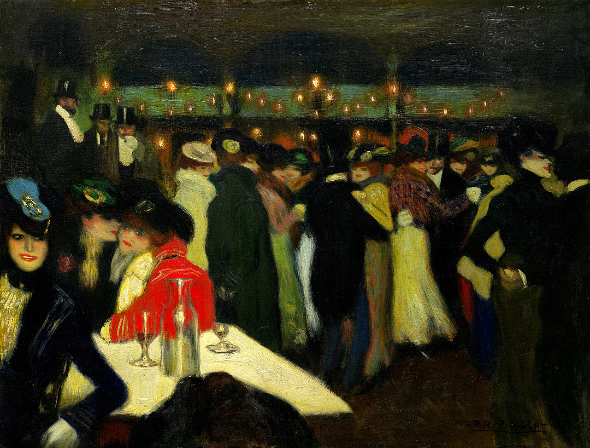

---

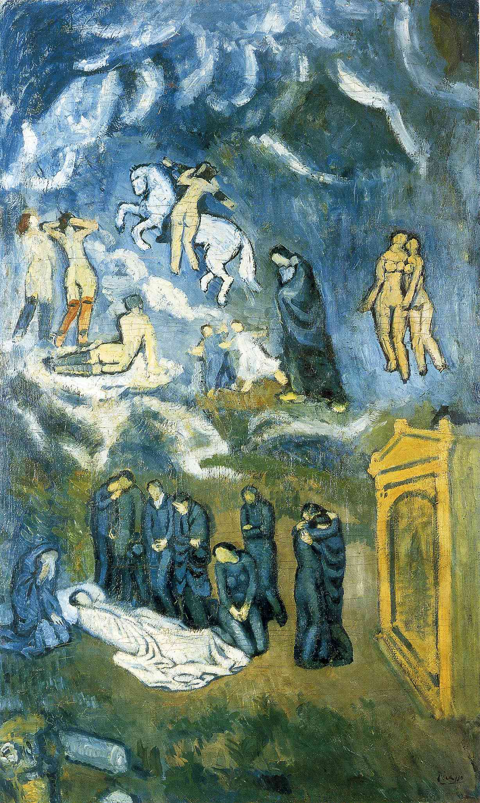

---

<!-- _class: lead -->

# Auktionen

---

<!-- _transition: wipe -->
# Buste de femme
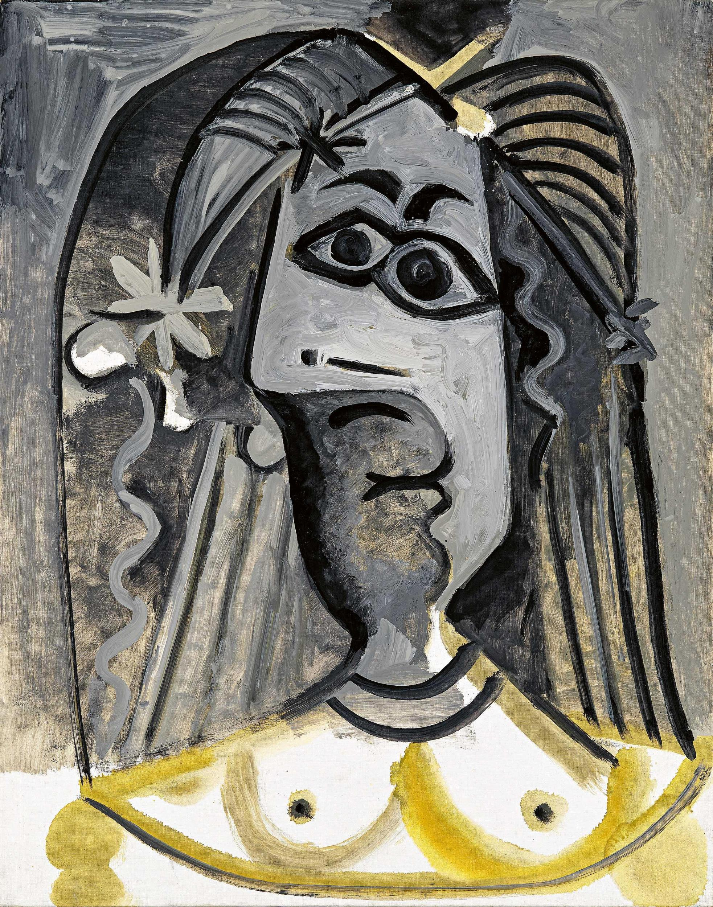

---

# Buste de femme
3.4 mio 

Picasso unterm Hammer | ARTE Re:

---

<!-- _transition: wipe -->
# Minotaure Mourant
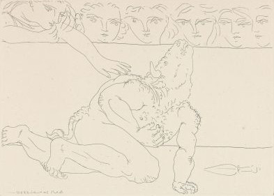

---

# Minotaure Mourant
8 600€

---

<!-- _transition: wipe -->
# Femme et chien
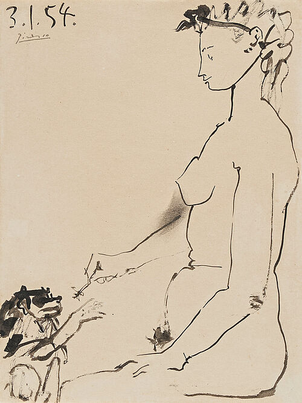

---

# Femme et chien
90 000€

---

<!-- _transition: wipe -->
# Les Femmes d'Alger (Version O)
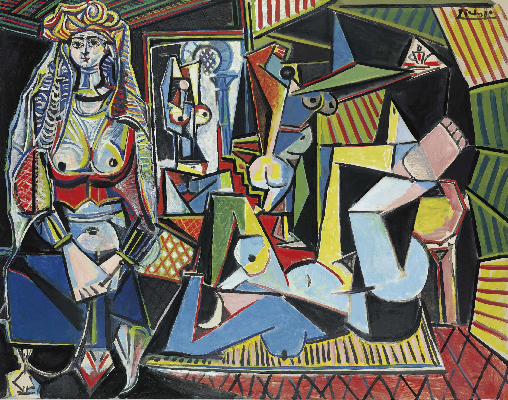

---

# Les Femmes d'Alger (Version O)
195 mio. Dollar
(= 181 mio. Euro)

---

<!-- _class: lead -->
# Danke für eure Aufmerksamkeit!
